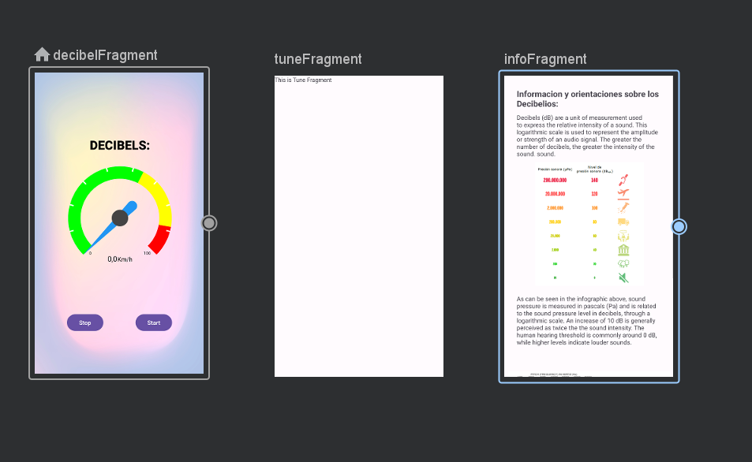

# Diseño 

Funciones y características clave que el sistema debe incluir. Estas funcionalidades son esenciales para cumplir con los objetivos del proyecto.
A la hora de diseño esta aplicación será sencilla. Deberá contar con una barra inferior de navegación que mueva al usuario a través de las tres pantallas que contendrá. (Aun que una de ellas sea inservible en esta versión del proyecto)

## Navegación 

Como es una aplicación que no comparte datos entre pantallas no, es necesario este campo.
Aquí una vista del grafo de navegación:
